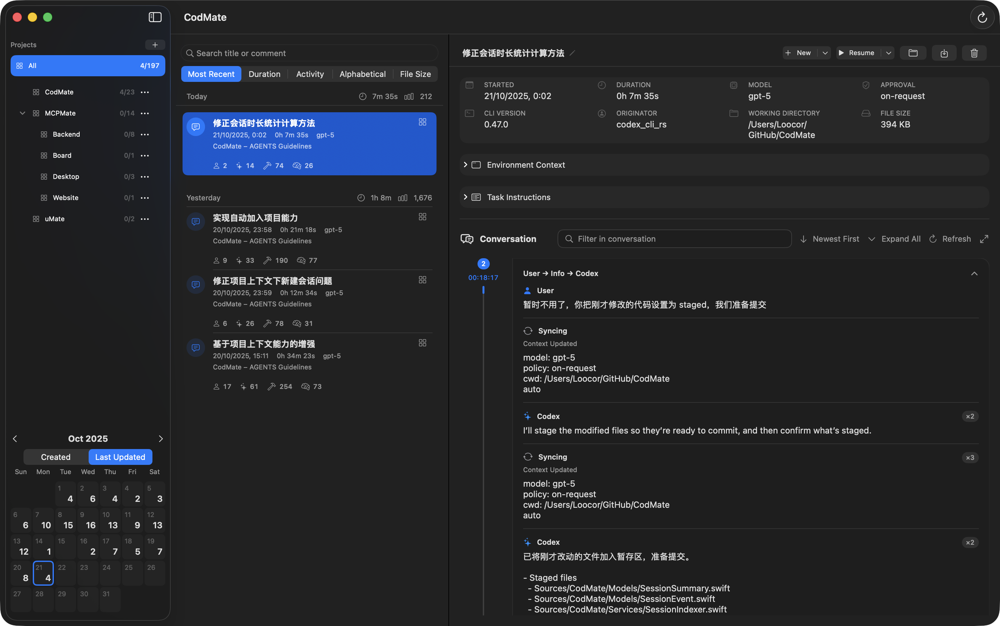

# CodMate



macOS SwiftUI app to browse, search, and resume Codex CLI sessions. It indexes `~/.codex/sessions` `.jsonl` logs, shows a fast, compact UI, and integrates with the Codex CLI to resume or start new sessions.

Status: macOS 15+, Swift 6, Xcode 16. Universal binary (arm64 + x86_64).

## Features
- Sidebar (Projects + Calendar)
  - Projects list with counts and a fixed “All” row; “New Project” sheet for name, directory, overview/instructions, and optional profile.
  - Assign sessions to projects from the list row context menu; memberships are stored under `~/.codmate/projects/`.
  - Auto‑assign: sessions launched via New inside a project are auto‑assigned when `cwd` and start‑time match.
  - Calendar month view (fixed bottom, ~280pt) with per‑day counts and Created/Updated toggle.
- List + search
  - Loads Today by default; segmented sort (Most Recent, Duration, Activity, etc.).
  - Quick search field for title/comment; Refresh button in the toolbar (pinned far right).
  - Rows show title, timestamps/duration, snippet, and compact metrics (user/assistant/tool/reasoning). Badges/indicators show: updating (live tail activity), running (currently resumed), awaiting follow‑up (agent completed).
- Detail pane
  - Sticky action bar: Resume (Terminal/iTerm2/Warp or Embedded), Reveal in Finder, Delete, Export Markdown.
  - “New” starts a fresh session using the focused session’s working directory and (when available) its Project Profile.
  - “New With Context” builds slim Markdown from selected sessions and starts a new session with that content as the initial prompt.
  - Copy real command button appears when the embedded terminal is active.
  - Task Instructions via DisclosureGroup (lazy loaded). Environment Context panel parses and renders `<environment_context>` entries.
  - Conversation timeline uses LazyVStack and differentiates user/assistant/tool/info bubbles.
- Session metadata (rename/comment)
  - Click the title to edit name/comment.
  - Stored per session under `~/.codmate/notes/<sessionId-sanitized>.json`; first‑run migration from the legacy Application Support JSON and automatic migration from `~/.codex/notes`.
- Codex Settings
  - Dedicated Settings › Codex page with tabs: Providers, Runtime, Notifications, Privacy, Raw Config.
  - Provider presets include K2, GLM, DeepSeek with “Get key” links and prefilled base URLs.
  - System notifications bridge via a managed `codmate-notify` helper; TUI notifications toggle.
- Dialectics (Diagnostics)
  - Codex sessions root probe (current vs default), counts/samples/errors with “Save Report…”.
  - Claude sessions directory probe (default path), counts and sample files.
  - CLI environment: preferred and resolved `codex` and `claude` paths and a PATH snapshot.

## Performance
- Fast path indexing: memory‑mapped reads; parse the first ~64 lines plus tail sampling (up to ~1 MB) to fix `lastUpdatedAt`.
- Background enrichment: full parse in constrained task groups; batched UI updates.
- Full‑text search: chunked scan (128 KB), case‑insensitive; avoids lowercasing the whole file.
- Caching: in‑memory NSCache + disk cache at `~/Library/Caches/CodMate/sessionIndex-v2.json` keyed by path+mtime.
- Sidebar statistics are global and decoupled from the list scope to keep navigation snappy.

## Architecture
- App: macOS SwiftUI (min macOS 15). Xcode project `CodMate.xcodeproj` and SwiftPM manifest.
- MVVM layering
  - Models: `SessionSummary`, `SessionEvent`, `DateDimension`, `SessionLoadScope`, …
  - Services: `SessionIndexer`, `SessionCacheStore`, `SessionActions`, `SessionTimelineLoader`, `CodexConfigService`, `SessionsDiagnosticsService`
  - ViewModel: `SessionListViewModel`
  - Views: SwiftUI only (no business logic)
- Concurrency & IO
  - Services that share caches are `actor`s; UI updates on MainActor only.
  - Cancel previous tasks on search/scope changes; guard `Task.isCancelled` in loops.
  - File IO prefers `Data(mappedIfSafe:)` and chunked reads; avoids loading huge files into Strings.

## Build
Prerequisites
- macOS 15+, Xcode 16 (or Swift 6 toolchain), Codex CLI installed somewhere on PATH.

Option A — Xcode
- Open `CodMate.xcodeproj`, select the “CodMate” scheme, destination “My Mac”, then Run or Archive.

Option B — CLI universal Release
```sh
xcodebuild \
  -project CodMate.xcodeproj \
  -scheme CodMate \
  -configuration Release \
  -destination 'generic/platform=macOS' \
  -derivedDataPath build/DerivedData \
  ARCHS='arm64 x86_64' ONLY_ACTIVE_ARCH=NO BUILD_LIBRARY_FOR_DISTRIBUTION=YES \
  MARKETING_VERSION=0.1.2 CURRENT_PROJECT_VERSION=1 \
  build
```
The app will be at `build/DerivedData/Build/Products/Release/CodMate.app`.

Option C — SwiftPM (developer run)
```sh
swift run CodMate
```
SwiftPM produces a console executable (`.build/*/CodMate`). Running it launches the SwiftUI app; no `.app` bundle is created by SwiftPM.

## Package DMG
Create a DMG with an Applications link:
```sh
APP=build/DerivedData/Build/Products/Release/CodMate.app
STAGE=artifacts/.stage-dmg
OUT=artifacts/release/CodMate-0.1.2-universal.dmg
rm -rf "$STAGE" && mkdir -p "$STAGE" "$(dirname "$OUT")"
cp -R "$APP" "$STAGE/" && ln -s /Applications "$STAGE/Applications"
hdiutil create -volname CodMate -srcfolder "$STAGE" -ov -format UDZO -imagekey zlib-level=9 "$OUT"
rm -rf "$STAGE"
```

Sign (optional, for distribution):
```sh
IDENTITY='Developer ID Application: Chengdu Wake.Link Technology Co., Ltd. (AN5X2K46ER)'
codesign --force --options runtime --timestamp -s "$IDENTITY" build/DerivedData/Build/Products/Release/CodMate.app
codesign -dv --verbose=2 build/DerivedData/Build/Products/Release/CodMate.app
codesign -f -s "$IDENTITY" --timestamp "$OUT"
```

Notarize (optional):
```sh
# Assuming you have stored a notarytool profile already
xcrun notarytool submit "$OUT" --keychain-profile <your-profile-name> --wait
xcrun stapler staple "$OUT"
xcrun stapler staple build/DerivedData/Build/Products/Release/CodMate.app
```

### Versioning strategy (build script)
- Marketing version (CFBundleShortVersionString): set with `BASE_VERSION` (e.g., `1.4.0`).
- Build number (CFBundleVersion): controlled by `BUILD_NUMBER_STRATEGY`:
  - `date` (default): `yyyymmddHHMM` (e.g., `202510291430`).
  - `git`: `git rev-list --count HEAD`.
  - `counter`: monotonically increments a file counter at `$BUILD_DIR/build-number` (override path via `BUILD_COUNTER_FILE`).
- DMG name: `CodMate-<BASE_VERSION>+<BUILD_NUMBER>-<ARCH>.dmg`.
- Override via environment variables when running the build script:
```sh
BASE_VERSION=1.4.0 BUILD_NUMBER_STRATEGY=date \
  ./scripts/macos-build-notarized-dmg.sh
```
This sets CFBundleShortVersionString to `1.4.0`, CFBundleVersion to the computed build number, and names the DMG accordingly.

## CLI Integration (codex)
- Executable resolution: user‑preferred path, then `/opt/homebrew/bin/codex`, `/usr/local/bin/codex`, then `env which codex`.
- Ensures PATH includes `/opt/homebrew/bin:/usr/local/bin:/usr/bin:/bin` when launching.
- Resume uses the original session `cwd` if it exists; otherwise falls back to the log file’s directory.
- New (detail): reuses the focused session’s working directory and, when a Project Profile is present, applies its model/sandbox/approval defaults (inline temporary profile injection if needed).
- New With Context: composes a slim Markdown prompt from selected sessions and starts a new Codex session with that content.
- External terminals: open in Apple Terminal, iTerm2 (direct), or Warp (path). Embedded terminal is available as an option.
- Copy real command: when embedded, a toolbar button copies the exact `codex resume <id>` invocation used.
- Flags supported by the UI when building commands:
  - Sandbox policy (`-s`): `read-only`, `workspace-write`, `danger-full-access`.
  - Approval policy (`-a`): `untrusted`, `on-failure`, `on-request`, `never`.
  - `--full-auto` convenience alias.
  - `--dangerously-bypass-approvals-and-sandbox` override.

## Scripts
- `scripts/gen-icons.sh` — generate `AppIcon.appiconset` from a source image or a directory of images.
- `scripts/codmate-notify` — bridges Codex TUI `notify` events to macOS notifications.

## Project Layout
```
CodMate.xcodeproj/          # Xcode project (single app target “CodMate”)
CodMate/                    # Assets and Info.plist (not in Copy Bundle Resources)
Sources/CodMate/            # App sources (Models / Services / ViewModels / Views)
scripts/                    # Helper scripts (icons, notifications)
Tests/                      # XCTest (light coverage)
```

## Known Pitfalls
- Do not use iOS‑only modifiers (e.g., `.navigationBarTrailing`) in macOS views.
- Prefer a toolbar search field (far‑right aligned) over `.searchable` to avoid hijacking toolbar slots on macOS.
- Keep `Info.plist` out of Copy Bundle Resources (Xcode otherwise warns and build fails).
- Outline row height needs explicit tightening (see `defaultMinListRowHeight` and insets in the row views).

## Development Tips
- Run tests: `swift test`.
- Formatting: follow existing code style; keep changes minimal and focused.
- Performance: measure large trees; first paint should be fast; enrichment is incremental.

## License
- Apache License 2.0. See `LICENSE` for full text.
- `NOTICE` includes project attribution. SPDX: `Apache-2.0`.
- Third-party attributions and license texts: see `THIRD-PARTY-NOTICES.md`.
